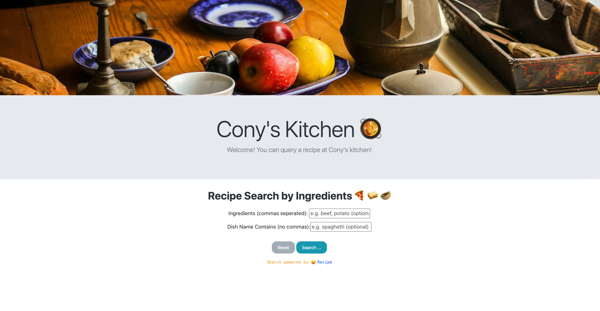

# Kitchen Recipe
### Intro 
This is a kitchen website. 
User can type in ingredients or dish name to 
search for their desired dish.
A remind info will display if there is no matching dishes.
### Mechanism
A rest API is used. 
see API [here](http://www.recipepuppy.com/about/api/)
#### REST (Representational State Transfer)
1. Client-Server: Separation of data, logics and presentations
2. Statelessness: No client states are stored on the server side.
3. Uniformed interface
    - Resource identification in requests
    - Self-descriptive messages
    - Hypermedia/Hyperlinks to resource
    - Enables resource manipulation through representations of them
4. Layered System: What's between the client and server is abstract
5. Cacheability: Response specifies whether they are cacheable (can be done implicitly)
6. Code on demand (optional): Servers can optionally return executable code

### Demo
